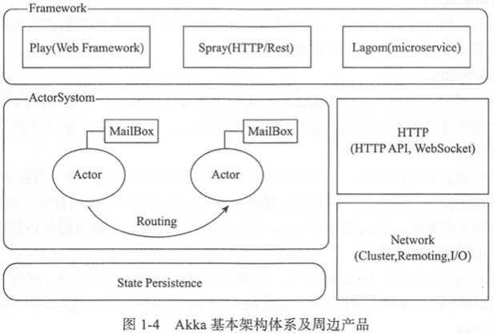
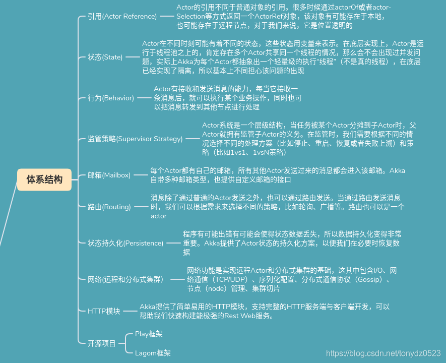

## Akka核心思想（[中文指南](https://guobinhit.github.io/akka-guide/)）

- ActorSystem：全局
- ActorRef：定位Actor
- 邮箱：存放消息（事件）
- 分发器：分发消息到Actor
- Actor

Actor模型：

see: https://www.cnblogs.com/MOBIN/p/7236893.html

Actor生命周期：

- start
    - preStart：申请资源
- restart
    - preRestart：停止该Actor的所有子Actor，并调用postStop钩子，释放资源
    - postRestart
- stop
    - postStop：释放资源
    - Actor停止后，ActorRef重定向到系统中的deadLettersActorRef，它是一个特殊的ActorRef，接收发送到已死亡的Actor的消息

特性：

- 任何Actor都可以作为监督器，但只能管理自己创建的Actor（监控状态、重启、停止）
- 大约270万个Actor可以存放在1G内存中，这与4096个线程占用1G内存有很大区别，意味着可以比直接使用线程更加自由的创建各种类型的Actor
- 单向消息：即发即丢
- 双向消息
- 出错恢复策略

#### 事件
传递消息涉及网络、主机、Actor邮箱、Actor消息处理函数等多个环节，所以非常脆弱。主要的模式有三种（参见RMP-164：确保送达机制）：
最多一次：消息在发出去就不用管，也不用保存消息传送的状态。所以消息可能会丢失。这是Actor默认采用的方式，简单而高效。
最少一次：发送后还要保存消息传送状态甚至进行重试，以确保收件人收到消息。所以消息不会丢失，但不能避免重复。
正好一次：除了发件人，还要在收件人保存消息传送状态，以确保收件人不会接到重复的消息。所以消息既不会丢失，也不会重复。

##### Akka线程配置（资源配置）
- 在Actor内部慎用阻塞IO，因为默认他们是跑在DefaultDispatcher进程上的，数量有限，而且和重要的系统分配共用
- 需要异步IO时指定新的自定义Dispatcher

#### watch
使用Dead Watch实现有关Actor停止时的互动。Dead Watch关系不仅限于父子之间，只要知道对方的ActorRef即可。
当被观察的Actor停止时，观察者Actor将会收到一个Terminated(actorRefOfWatchee)信号。
由于该信号无法附加其他信息，所以推荐做法是将其再包装成一条消息WatcheeTerminated，
并在创建被观察者时就用context.watchWith(watcheeActor, WatcheeTerminated(watcheeActor,...))建立观察关系。（WatcheeTerminated会被context自动填充吗？貌似是的。）

#### 读写分离
遵循CQRS的原则，在Actor里也推荐读写分离，将Query放入单独的Actor，避免对业务Actor的干扰。在示例中，由业务Actor负责创建Query Actor。

#### 查询超时
Query通常都要设置超时，于是引出Actor内建的调度机制，在工厂的Behaviors.setup中使用Behaviors.withTimers定义timers，
然后在Actor类里用timers.startSingleTime来调度一条经过给定延时后才发出的消息。

##### 协议+行为

一个actor接收到消息之后的行为包含如下3个步骤：
     1. 发送一条或多条消息给其他的actor
     2. 创建子acotr
     3. 返回一个新的行为，准备接收下一个消息

#### 任务拆分聚合方案
https://www.jianshu.com/p/669cc13c474f

#### 优秀文档
https://www.cnblogs.com/Abbey/p/13151813.html

#### 设计点
- 事件幂等？状态机
- 