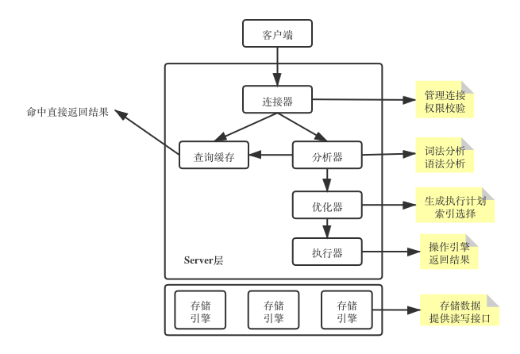

## MySQL

### 基础架构

### Redo Log & Binlog

##### Redo Log：重做日志

- 是**WAL（Write-Ahead Loggin）方案**的载体：先写日志（这里的Redo Log），再写存储引擎；分层操作，可提升性能，防止操作丢失（**crash-safe**）

- **工作在存储引擎层**：因为MySQL期初是没有InnoDB的，而Server的Binlog是没有crash-safe功能的，所有InnoDB实现的WAL

- 配置为一组4个文件，每个文件1G，从头开始写，写到末尾就又回到开 头循环写。
  - 两个指针操作日志偏移量（write pos）与持久化偏移量（checkpoint）：

##### BinLog：归档日志

- 工作在Server层

##### 对比：

| Redo Log                                     | Binlog                                                       |
| -------------------------------------------- | ------------------------------------------------------------ |
| InnoDB引擎特有                               | Server层通用                                                 |
| 物理日志（记录了：某个数据页上做了什么修改） | 逻辑日志（记录语句的原始逻辑，比如：给ID=2这一行的c字段加1） |
| 循环写，固定大小                             | 追加写，写到一定大小后，会创建下一个文件                     |

**问题：为什么有两套日志？**

答：期初MySQL无InnoDB引擎，只能利用Binlog进行日志归档，后期InnoDB引擎为支持crash-safe，实现了WAL方案

**问题：先写redo log还是先写binlog**

答：两种方式都可以，先写redo log，在写binlog：执行器写完数据后（redolog已写完），才会生成binlog记录操作归档，写入磁盘，重点是这两个流程需要一个两阶段提交来保证一致性

### Update/Insert执行流程

> update T set c=c+1 where ID=2;

1. 执行器先找引擎取 ID=2 这一行。ID 是主键，引擎直接用树搜索找到这一行。如果 ID=2 这一行所在的数据页本来就在内存中，就直接返回给执行器;否则，需要先从磁盘读入内 存，然后再返回。
2. 执行器拿到引擎给的行数据，把这个值加上 1，比如原来是 N，现在就是 N+1，得到新的 一行数据，再调用引擎接口写入这行新数据。
3. 引擎将这行新数据更新到内存中，同时将这个更新操作记录到 redo log 里面，此时 redo log 处于 **prepare** 状态。然后告知执行器执行完成了，随时可以提交事务。
4. 执行器生成这个操作的 binlog，并把 binlog 写入磁盘。
5. 执行器调用引擎的提交事务接口，引擎把刚刚写入的 redo log 改成提交(**commit**)状 态，更新完成。

### 两阶段提交

redo log 与 binlog存在依赖关系，任何一个中间出现问题，就会导致异常数据恢复时，出现不一致情况，所以使用两阶段提交（prepare、commit）来解决这个问题

### 事务

ACID：

- read uncommitted：一个事务还没提交时，它做的变更就能被别的事务看到
- read committed：一个事务提交之后，它做的变更才会被其他事务看到
- repeatable read：一个事务执行过程中看到的数据，总是跟这个事务在启动时看到的数据是一 致的（**零时视图**）。当然在可重复读隔离级别下，未提交变更对其他事务也是不可见的
- serializable：对于同一行记录，“写”会加“写锁”，“读”会加“读锁”。当出现 读写锁冲突的时候，后访问的事务必须等前一个事务执行完成，才能继续执行

Problem：

- dirty read
- nonrepeatable read
- phantom read

实现：

- **回滚段**：每条记录在更新的时候都会同时记录一条回滚操作。记录上的最新值，通 过回滚操作，都可以得到前一个状态的值

