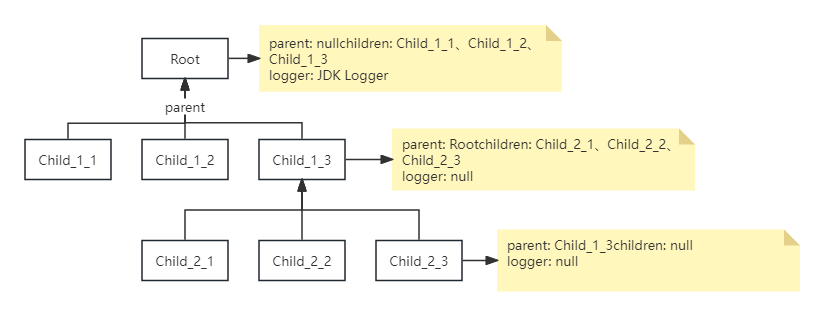

## Java日志

### Java Logging

从Java1.4引入，部分设计参考了Log4j

##### 日志数据类型：LogRecord

> Log4j中命名为 LogEvent

##### 控制流程


##### 日志Filter：决定日志是否输出（java.util.logging.Filter）

```java
/**
 * Check if a given log record should be published.
 * @param record  a LogRecord
 * @return true if the log record should be published.
 */
public boolean isLoggable(LogRecord record);
```

##### 日志处理Handler：处理（java.util.logging.Handler）

- StreamHandler - 写入OutputStream中
- ConsoleHandler
- FileHandler
- SocketHandler
- MemoryHandler

##### 日志级别（java.util.logging.Level）

Logger有级别，Handler也有级别

##### 日志格式化：Formatters（java.util.logging.Formatter）

JavaSE：

- SimpleFormatter - 编写简要的“人类可读”的日志记录摘要
- XMLFormatter - 编写详细的XML结构信息

Apache：

- JdkLoggerFormatter

- OneLineFormatter

Spring：

- org.springframework.boot.logging.java.SimpleFormatter

##### 日志管理器（LogManager）- 重要

全局的 LogManager 对象，用于跟踪全局日志记录信息。LogManager 对象可以使用 静态 LogManager.getLogManager 方法获得。在 LogManager 初始化期间根据系统属 性创建的。此属性允许容器应用程序(如EJB容器)用其自身的LogManager子类代替默认 类。

LogManager 对象包括:

- 命名的 Logger 分层名称空间
- 从配置文件中读取的一组日志记录控制属性
  - readConfiguration()

##### 日志配置文件（Configuration File）

JDK的JRE的lib目标下有默认全局的Log配置logging.properties

##### 面试：

为啥Java Logging中的日志级别 Level 不使用枚举实现？  - Level是1.4就有了，而枚举在1.5才有


#### LogManager

有一个全局LogManager对象，用于维护有关Loggers和日志服务的一组共享状态。

这个LogManager对象：

- 管理Logger对象的分层命名空间。 所有命名的记录器都存储在此命名空间中。
- 管理一组日志记录控制属性。 这些是简单的键值对，处理程序和其他日志记录对象可以使用它们进行自我配置。

可以使用LogManager.getLogManager（）检索全局LogManager对象。 LogManager对象是在类初始化期间创建的，随后无法更改。

在启动时，使用java.util.logging.manager系统属性找到LogManager类。

### LogManager配置

在LogManager初始化期间，LogManager通过[`readConfiguration()`](https://www.apiref.com/java11-zh/java.logging/java/util/logging/LogManager.html#readConfiguration())方法初始化日志记录配置。 默认情况下，使用LogManager默认配置。 LogManager读取的日志记录配置必须采用[properties file](https://www.apiref.com/java11-zh/java.base/java/util/Properties.html)格式。

LogManager定义了两个可选的系统属性，允许控制初始配置，如[`readConfiguration()`](https://www.apiref.com/java11-zh/java.logging/java/util/logging/LogManager.html#readConfiguration())方法中所指定：

- “java.util.logging.config.class”
- “java.util.logging.config.file”

可以在命令行上将这两个系统属性指定为“java”命令，或者作为传递给JNI_CreateJavaVM的系统属性定义。

记录器和处理程序的[properties](https://www.apiref.com/java11-zh/java.base/java/util/Properties.html)将具有以处理程序或记录器的点分隔名称开头的名称。
全局日志记录属性可能包括：

- 属性“处理程序”。 这为处理程序类定义了一个以空格或逗号分隔的类名列表，以便在根Logger（名为“”的Logger）上加载和注册为处理程序。 每个类名必须是具有默认构造函数的Handler类。 请注意，这些处理程序可能会在首次使用时延迟创建。
- 属性“<logger> .handlers”。 这为处理程序类定义了一个以空格或逗号分隔的类名列表，以便加载和注册为指定记录程序的处理程序。 每个类名必须是具有默认构造函数的Handler类。 请注意，这些处理程序可能会在首次使用时延迟创建。
- 属性“<logger> .handlers.ensureCloseOnReset”。 这定义了一个布尔值。 如果未定义“<logger> .handlers”或为空，则忽略此属性。 否则默认为`true` 。 当值为`true` ，保证在[reset()](https://www.apiref.com/java11-zh/java.logging/java/util/logging/LogManager.html#reset())关闭与记录器关联的处理程序并关闭。 可以通过在配置中显式设置“<logger> .handlers.ensureCloseOnReset = false”来关闭此功能。 请注意，关闭此属性会导致引入资源泄漏的风险，因为在调用`reset()`之前，记录器可能会收集垃圾，从而阻止其处理程序在`reset()`上关闭。 在这种情况下，应用程序有责任确保在记录器被垃圾收集之前关闭处理程序。
- 属性“<logger> .useParentHandlers”。 这定义了一个布尔值。 默认情况下，除了处理日志消息本身之外，每个记录器都会调用其父记录，这通常也会导致消息由根记录器处理。 将此属性设置为false时，需要为此记录器配置Handler，否则不会传递任何记录消息。
- 属性“config”。 此属性旨在允许运行任意配置代码。 该属性定义了一个以空格或逗号分隔的类名列表。 将为每个命名类创建一个新实例。 每个类的默认构造函数可以执行任意代码来更新日志记录配置，例如设置记录器级别，添加处理程序，添加过滤器等。

请注意，在任何用户类路径之前，首先在系统类路径上搜索在LogManager配置期间加载的所有类。 这包括LogManager类，任何配置类和任何处理程序类。

记录器根据点分隔名称组织成命名层次结构。 因此“abc”是“ab”的孩子，但“a.b1”和a.b2“是同龄人。

名称以“.level”结尾的所有属性都假定为Loggers定义日志级别。 因此，“foo.level”为命名层次结构中的任何子项定义了一个名为“foo”和（递归）的记录器的日志级别。 日志级别按属性文件中定义的顺序应用。 因此，树中子节点的级别设置应该在其父级的设置之后进行。 属性名称“.level”可用于设置树根的级别。

LogManager对象上的所有方法都是多线程安全的。


#### Tomcat LogManager

* Why：
  - Apache Tomcat 提供了一个可识别类加载器的自定义LogManager。这样做是为了避免日志混淆的问题，即多个 *Web* 应用程序（每个应用程序都有自己的类加载器）创建具有相同名称的记录器。
  - 自定义 LogManager 还允许创建同一 Handler 类的多个实例。它通过在处理程序类名中添加数字前缀来实现此目的。因此，它以不同的方式对待“handlers”和“.handlers”属性。第一个定义所有处理程序，第二个定义根记录器的处理程序。

- LogNode管理：



#### 定制LogManager

对于大多数开发者来说，很少有需要定制LogManager的时候，只有是需要单独开发一个产品，需要完全独立的logger机制时才有可能需要定制LogManager，比如：

- 希望自由定制log的输出路径
- 希望完全定制log的format
- 希望日志中的国际化信息采用自己定义的一套机制等

定制目标：

- 新增自定义LogManager
  - 覆盖addLogger方法
  - 如果需要的话，也可以定制获取日志配置的方法：readConfiguration(xxx)
  - 自己管理Logger后，也需要实现reset方法，该方法用于重置日志配置
  
- 给Logger新增自定义的Hander
  - 覆盖publish方法
- 给Handler新增自定义的Fromatter
  - 覆盖format方法

定制实现：

- 实现一个继承自java.util.logging.LogManager的类
- 覆盖java.util.logging.LogManager的addLogger方法
- addLogger方法调用了子类的internalInitializeLogger方法，internalInitializeLogger方法中先清空logger的所有handler，然后再增加一个自定义的Handler
- 定制自己的Handler
- 定制自己的Fromatter